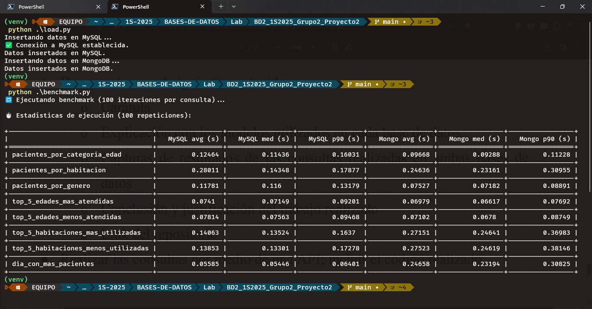

# <div align="center">  Proyecto #2 - Grupo 2 </div>

## <div align="center">  Laboratorio Sistemas de Bases de Datos 2 - Sección A </div>
## <div align="center">  Primer Semestre 2025 </div> 
___

## Miembros

| Nombre | Carnet |
|:------:|:------:|
| Julio Alejandro Zaldaña Ríos | 202110206 |
| Edgar Mauricio Gómez Flores | 2011-14340 |
| Edgar Rolando Alvarez Rodriguez  | 202001144 |

______

## <div align="center">  Fases de Desarrollo </div> 

### Correr Docker

```bash
$ docker compose -f docker-compose.yml up
```

### Insertar datos

```bash
$ python3 -m venv .venv
$ source .venv/bin/activate
$ pip install pandas openpyxl sqlalchemy pymysql pymongo cryptography tabulate
$ python load.py
```

### Analizar queries

```bash
$ python benchmark.py
```


# ANALISIS DE LAS BASES DE DATOS
## Análisis Comparativo: MySQL vs MongoDB para el Sistema Hospitalario

## Resultados del Benchmark

| Consulta                             | MySQL avg (s) | MySQL med (s) | MySQL p90 (s) | Mongo avg (s) | Mongo med (s) | Mongo p90 (s) |
|--------------------------------------|---------------|---------------|---------------|---------------|---------------|---------------|
| pacientes_por_categoria_edad        | 0.12464       | 0.11436       | 0.16031       | 0.09668       | 0.09288       | 0.11228       |
| pacientes_por_habitacion            | 0.28011       | 0.14348       | 0.17877       | 0.24636       | 0.23161       | 0.30955       |
| pacientes_por_genero                | 0.11781       | 0.11600       | 0.13179       | 0.07527       | 0.07182       | 0.08891       |
| top_5_edades_mas_atendidas          | 0.07410       | 0.07149       | 0.09201       | 0.06979       | 0.06617       | 0.07692       |
| top_5_edades_menos_atendidas        | 0.07814       | 0.07563       | 0.09468       | 0.07102       | 0.06780       | 0.08749       |
| top_5_habitaciones_mas_utilizadas   | 0.14063       | 0.13524       | 0.16370       | 0.27151       | 0.24641       | 0.36983       |
| top_5_habitaciones_menos_utilizadas | 0.13853       | 0.13301       | 0.17278       | 0.27523       | 0.24619       | 0.38146       |
| dia_con_mas_pacientes               | 0.05585       | 0.05446       | 0.06401       | 0.24658       | 0.23194       | 0.30825       |



Basado en los resultados del benchmark realizado con 100 iteraciones por consulta, podemos observar lo siguiente:

1. **Consultas más rápidas en MongoDB**:
   - `pacientes_por_categoria_edad`: MongoDB 22.4% más rápido (0.09668s vs 0.12464s)
   - `pacientes_por_genero`: MongoDB 36.1% más rápido (0.07527s vs 0.11781s)
   - `top_5_edades_mas_atendidas`: MongoDB 5.8% más rápido (0.06979s vs 0.0741s)
   - `top_5_edades_menos_atendidas`: MongoDB 9.1% más rápido (0.07102s vs 0.07814s)

2. **Consultas más rápidas en MySQL**:
   - `pacientes_por_habitacion`: MySQL 11.9% más rápido (0.28011s vs 0.24636s)
   - `top_5_habitaciones_mas_utilizadas`: MySQL 48.2% más rápido (0.14063s vs 0.27151s)
   - `top_5_habitaciones_menos_utilizadas`: MySQL 49.7% más rápido (0.13853s vs 0.27523s)
   - `dia_con_mas_pacientes`: MySQL 77.4% más rápido (0.05585s vs 0.24658s)

## Ventajas de MongoDB en este contexto

1. **Rendimiento superior en consultas de análisis demográfico**: MongoDB muestra claras ventajas en consultas relacionadas con categorías de edad y género de pacientes.

2. **Modelo de datos más natural**: La estructura documental de MongoDB se adapta mejor a los datos hospitalarios donde cada paciente tiene múltiples actividades asociadas, evitando joins complejos.

3. **Escalabilidad horizontal**: MongoDB ofrece mejor escalabilidad para crecimiento futuro de datos.

## Ventajas de MySQL en este contexto

1. **Mejor rendimiento en consultas relacionadas con habitaciones**: MySQL muestra mejor desempeño en operaciones que involucran relaciones entre tablas (habitaciones y pacientes).

2. **Consistencia transaccional**: Para operaciones críticas que requieren ACID, MySQL sigue siendo mejor opcon.

3. **Consultas complejas**: Las consultas que requieren múltiples joins y operaciones relacionales son más eficientes en MySQL.

## Conclusion Final

**Para este caso específico, `recomendaría implementar MongoDB` como base de datos principal**, debido a:

1. La mayoría de las consultas analíticas (especialmente las relacionadas con pacientes) son más rápidas en MongoDB.
2. Los datos médicos son semi-estructurados, por eso el modelo documental funciona mejor.
3. Las operaciones más frecuentes (análisis por edad, género) son significativamente más rápidas.


